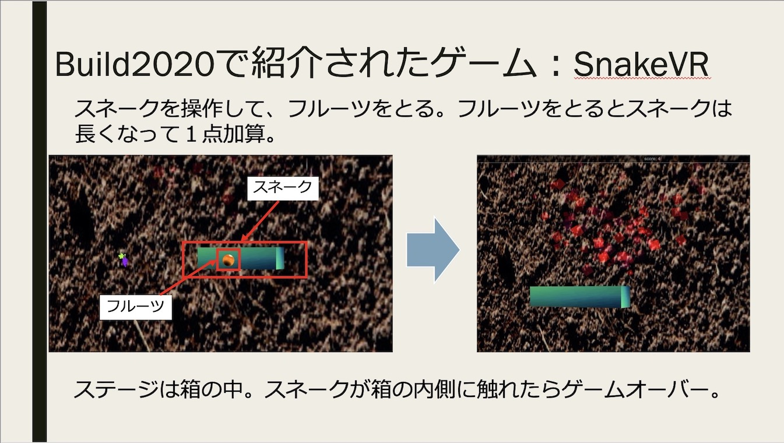

# SnakeVR-build2020-explanation


  

# Background

このリポジトリは、Build2020の講演で紹介されたBabylon.jsベースのミニゲーム 「[SnakeVR](https://github.com/cassieview/SnakeVR)」の解説用です。  

詳細は以下のブログ記事をご参考ください。  

[Build2020で紹介されたBabylon.js (TypeScript) 製ミニゲーム「SnakeVR」のソースコードを調べてみました](https://www.crossroad-tech.com/entry/babylonjs-build2020-snakevr-tips)

# Usage

1. git clone and npm install  

2. npm start  (webpack-dev-serverにより、ローカルサーバが起動します)

3. ``` http://localhost:8080 ``` にブラウザからアクセス  

ポート番号変更など、サーバ関係の設定は、webpack.config.jsをご確認ください。  

# Special Thanks!

Great Thanks for the SnakeVR Github repository!  

https://github.com/cassieview/SnakeVR
